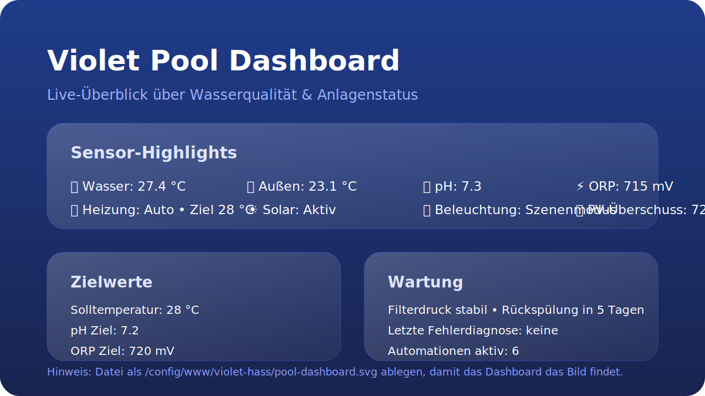

# 🏊 Violet Pool Controller für Home Assistant

[![GitHub Release][releases-shield]][releases]
[![Downloads][downloads-shield]][releases]
[![GitHub Activity][commits-shield]][commits]
[![License][license-shield]](LICENSE)
[![HACS][hacs-badge]][hacs]

[![Discord][discord-shield]][discord]
[![Community Forum][forum-shield]][forum]
[![Buy Me A Coffee][buymeacoffee-badge]][buymeacoffee]
[](https://ts.la/sebastian564489)


[](https://github.com/Xerolux/violet-hass/actions/workflows/release.yml)


> **Verwandle deinen Pool in einen Smart Pool!** Diese umfassende Home Assistant Integration bietet vollständige Kontrolle und Überwachung deines Violet Pool Controllers.

![Violet Home Assistant Integration][logo]

## 📋 Inhaltsverzeichnis

- [🌟 Features](#-features)
- [⚡ Schnellstart](#-schnellstart)
- [🎨 Dashboard & Blueprints](#-dashboard--blueprints)
- [📦 Installation](#-installation)
- [⚙️ Konfiguration](#️-konfiguration)
- [🧩 Verfügbare Entitäten](#-verfügbare-entitäten)
- [🤖 Automatisierungen](#-automatisierungen)
- [🚨 Fehlerbehebung](#-fehlerbehebung)
- [💝 Unterstützung](#-unterstützung)

---

## 🌟 Features

### 🎯 **Kernfunktionen**
- **🌡️ Intelligente Klimasteuerung** - Heizung & Solar mit Zeitplanung
- **🧪 Automatische Chemie-Dosierung** - pH & Chlor mit Sicherheitsgrenzen  
- **🏊 Smarte Abdeckungssteuerung** - Wetterabhängige Automatisierung
- **💧 Filter-Management** - Automatische Rückspülung & Wartung
- **💡 LED-Beleuchtung** - Vollständige RGB/DMX-Steuerung
- **📱 Mobile-Ready** - Kontrolle von überall über HA App
- **🔧 100% Lokal** - Keine Cloud erforderlich, vollständige Privatsphäre

### 📊 **Überwachung & Sensoren**
- **Wasserchemie**: pH, Redox (ORP), Chlorgehalt mit Trend-Tracking
- **Temperaturen**: Pool, Umgebung, Solar-Kollektor
- **System-Status**: Pumpen, Heizung, Filterdruck, Wasserstände  
- **Anlagen-Gesundheit**: Laufzeit, Fehlererkennung, Wartungsalarme

### 🤖 **Smart Automation**
- **Energie-Optimierung**: PV-Überschuss-Modus für Solarheizung
- **Wetter-Integration**: Automatische Reaktionen auf Umweltbedingungen
- **Wartungsplanung**: Intelligente Zyklen für alle Anlagenteile
- **Sicherheitssysteme**: Notabschaltungen & Überlaufschutz
- **Custom Scenes**: Pool-Party, Eco, Winter & Urlaubs-Modi

---

## ⚡ Schnellstart

### 1. Vorbereitung
- ✅ Home Assistant 2024.6+ installiert (getestet mit 2024.12.0 und 2025.1.4)
- ✅ HACS installiert ([Anleitung](https://hacs.xyz/docs/setup/download))
- ✅ Violet Pool Controller im Netzwerk erreichbar
- ✅ Controller-IP-Adresse bekannt (z.B. 192.168.1.100)

### 2. Installation (2 Minuten)
```
HACS → Integrationen → Custom Repository hinzufügen:
Repository: https://github.com/xerolux/violet-hass
Kategorie: Integration
```

### 3. Konfiguration (3 Minuten)
```
Einstellungen → Geräte & Dienste → Integration hinzufügen → "Violet Pool Controller"
Host eingeben → Features auswählen → Fertig!
```

**🎉 Geschafft!** Dein Pool ist jetzt smart und bereit für Automatisierungen.

---

## 🎨 Dashboard & Blueprints

### 📱 **Vorgefertigte Dashboard-Vorlagen**

Nutze unsere professionellen Dashboard-Karten für eine intuitive Bedienung:

| Dashboard | Beschreibung | Quick-Link |
|-----------|--------------|------------|
| **🖥️ Vollständig** | Desktop/Tablet mit allen Features | [📋 YAML kopieren](https://raw.githubusercontent.com/Xerolux/violet-hass/main/Dashboard/pool_control_card.yaml) |
| **📱 Kompakt** | Mobile-optimiert, Schnellzugriff | [📋 YAML kopieren](https://raw.githubusercontent.com/Xerolux/violet-hass/main/Dashboard/pool_control_compact.yaml) |

**Features der Dashboards:**
- ✅ ON/OFF/AUTO Modus-Steuerung mit Select-Entities
- ✅ Pumpengeschwindigkeit direkt neben Steuerung
- ✅ Temperatur-Gauges für Pool, Solar, Außen
- ✅ Wasserchemie-Übersicht (pH, Chlor, Redox)
- ✅ 24h-History-Graphen
- ✅ System-Status-Monitoring

📖 **[Vollständige Anleitung](Dashboard/README.md)**

### 🤖 **Automation Blueprints (One-Click Install)**

Klicke auf die Buttons für automatische Installation der Blueprints:

| Blueprint | Beschreibung | Installation |
|-----------|--------------|--------------|
| **🌡️ Temperatur** | Intelligente Heizungs- und Solarsteuerung | [](https://my.home-assistant.io/redirect/blueprint_import/?blueprint_url=https://raw.githubusercontent.com/Xerolux/violet-hass/main/blueprints/automation/pool_temperature_control.yaml) |
| **🧪 pH-Kontrolle** | Automatische pH-Wert Korrektur | [](https://my.home-assistant.io/redirect/blueprint_import/?blueprint_url=https://raw.githubusercontent.com/Xerolux/violet-hass/main/blueprints/automation/pool_ph_control.yaml) |
| **🏊 Abdeckung** | Wetterbasierte Cover-Automatik | [](https://my.home-assistant.io/redirect/blueprint_import/?blueprint_url=https://raw.githubusercontent.com/Xerolux/violet-hass/main/blueprints/automation/pool_cover_control.yaml) |
| **🔄 Rückspülung** | Automatische Filter-Reinigung | [](https://my.home-assistant.io/redirect/blueprint_import/?blueprint_url=https://raw.githubusercontent.com/Xerolux/violet-hass/main/blueprints/automation/pool_backwash_control.yaml) |
| **🔔 Modus-Benachrichtigungen** | Überwachung der ON/OFF/AUTO Modi | [](https://my.home-assistant.io/redirect/blueprint_import/?blueprint_url=https://raw.githubusercontent.com/Xerolux/violet-hass/main/blueprints/automation/pool_mode_notifications.yaml) |

📖 **[Blueprint-Dokumentation](blueprints/automation/README.md)**

---

## 📦 Installation

### 🚀 **HACS Installation (Empfohlen)**

**Schritt 1: Repository hinzufügen**
1. HACS öffnen → ⋮ (drei Punkte) → "Benutzerdefinierte Repositorys"
2. URL: `https://github.com/xerolux/violet-hass`
3. Kategorie: "Integration" → "Hinzufügen"

**Schritt 2: Integration installieren**
1. Nach "Violet Pool Controller" suchen
2. "Herunterladen" klicken
3. Home Assistant neu starten

### 🔧 **Manuelle Installation**

<details>
<summary>Für Entwickler & Fortgeschrittene (Klicken zum Erweitern)</summary>

```bash
# Option 1: Git Clone
cd /config/custom_components/
git clone https://github.com/xerolux/violet-hass.git violet_pool_controller

# Option 2: Download
wget https://github.com/xerolux/violet-hass/archive/main.zip
unzip main.zip
mv violet-hass-main/custom_components/violet_pool_controller /config/custom_components/

# Neustart erforderlich
```
</details>

---

## ⚙️ Konfiguration

### 🎯 **Basis-Setup**

Die Konfiguration erfolgt komplett über die UI – kein YAML nötig!

**Integration hinzufügen:**
```
Einstellungen → Geräte & Dienste → Integration hinzufügen → "Violet Pool Controller"
```

### 📋 **Konfigurationsoptionen**

| Einstellung | Beispiel | Beschreibung |
|-------------|----------|--------------|
| **Host** | `192.168.1.100` | IP-Adresse des Controllers |
| **Username/Password** | `admin` / `••••` | Optional für Basic Auth |
| **SSL verwenden** | ☑ | Bei HTTPS-Nutzung aktivieren |
| **Abfrageintervall** | `30s` | Update-Frequenz (10–300 s) |
| **Pool-Größe** | `50 m³` | Für Dosierungsberechnungen |
| **Pool-Typ & Desinfektion** | `outdoor`, `chlorine` | Optimiert Default-Werte |

### 🎛️ **Feature- & Sensor-Auswahl**

Der Einrichtungsassistent führt dich durch zwei Auswahllisten:

1. **Aktive Features** – nur Komponenten aktivieren, die auch verkabelt sind (z. B. Heizung, Solar, PV-Überschuss, digitale Eingänge).
2. **Dynamische Sensoren** – beim ersten Start werden alle Sensoren des Controllers gelesen und gruppiert. Du kannst per Mehrfachauswahl entscheiden, welche Werte in Home Assistant landen sollen.

> 💡 Keine Auswahl getroffen? Dann erstellt die Integration automatisch alle verfügbaren Sensoren (voll kompatibel zu bestehenden Installationen).

### 🧰 Erweiterte Optionen

Über *Einstellungen → Geräte & Dienste → Violet Pool Controller → Konfigurieren* kannst du jederzeit nachjustieren:

- Abfrageintervall, Timeout und Retry-Limits
- Aktive Features (z. B. PV-Überschuss nur im Sommer)
- Sensor-Gruppen (praktisch, wenn du die Anzeige auf die wichtigsten Werte reduzieren willst)

Alle Änderungen werden ohne Neustart übernommen.

---

## 🖥️ Lovelace Dashboard

Damit du sofort loslegen kannst, liegt ein fertiges Dashboard bei:

- YAML-Datei: [`Dashboard/pool-dashboard.yaml`](Dashboard/pool-dashboard.yaml)
- Vorschau-Bild: 

**Installation:**

1. Datei `Dashboard/pool-dashboard.yaml` nach `/config/` kopieren.
2. Optional: `screenshots/pool-dashboard.svg` nach `/config/www/violet-hass/` legen, damit das Dashboard das Vorschaubild findet.
3. In Home Assistant → *Einstellungen → Dashboards* → ⋮ → *Dashboard aus YAML importieren*.
4. Falls deine Entitäten anders heißen (z. B. wegen mehrerer Controller), per Suchen/Ersetzen in der YAML-Datei anpassen.

Das Dashboard nutzt ausschließlich Standard-Karten – keine zusätzlichen Custom-Cards nötig.

---

## 🧩 Verfügbare Entitäten

Die Integration erstellt automatisch alle relevanten Entitäten basierend auf deiner Controller-Konfiguration:

### 🌡️ **Klimasteuerung**
```yaml
climate.pool_heater          # Hauptheizung mit Thermostat
climate.pool_solar           # Solar-Kollektor Management
```

### 📊 **Sensoren** 
```yaml
# Wasserchemie
sensor.pool_temperature      # Aktuelle Wassertemperatur  
sensor.pool_ph_value         # pH-Wert (6.0-8.5)
sensor.pool_orp_value        # Redoxpotential (mV)
sensor.pool_chlorine_level   # Freies Chlor (mg/l)

# System-Status
sensor.filter_pressure       # Filtersystem-Druck
sensor.water_level          # Pool-Wasserstand
sensor.pump_runtime         # Pumpen-Laufzeit heute
sensor.energy_consumption   # Energieverbrauch
```

### 💡 **Schalter & Steuerungen**
```yaml
# Hauptkomponenten
switch.pool_pump            # Filterpumpe (variable Geschwindigkeit)
switch.pool_heater          # Heizung Ein/Aus
switch.pool_solar           # Solar-Zirkulation
switch.pool_lighting        # Pool-Beleuchtung

# Chemie-Dosierung  
switch.ph_dosing_minus      # pH- Dosierpumpe
switch.ph_dosing_plus       # pH+ Dosierpumpe
switch.chlorine_dosing      # Chlor-Dosierung

# Wartung & Extras
switch.backwash             # Rückspül-Zyklus
switch.pool_cover           # Abdeckung
switch.pv_surplus_mode      # Solar-Überschuss-Modus
```

---

## 🤖 Automatisierungen

### 🎯 **Custom Services**

Die Integration bietet spezialisierte Services für erweiterte Automatisierung:

<details>
<summary><strong>🔧 Kern-Services</strong> (Klicken zum Erweitern)</summary>

#### `violet_pool_controller.turn_auto`
Gerät in Automatikmodus schalten:
```yaml
service: violet_pool_controller.turn_auto
target:
  entity_id: switch.pool_pump  
data:
  auto_delay: 30  # Optional: Verzögerung in Sekunden
```

#### `violet_pool_controller.set_pv_surplus`
Solar-Überschuss-Modus aktivieren:
```yaml
service: violet_pool_controller.set_pv_surplus
target:
  entity_id: switch.pv_surplus_mode
data:
  pump_speed: 2   # Geschwindigkeitsstufe 1-3
```
</details>

<details>
<summary><strong>🧪 Chemie-Services</strong> (Klicken zum Erweitern)</summary>

#### `violet_pool_controller.manual_dosing`
Manuelle Dosierung auslösen:
```yaml  
service: violet_pool_controller.manual_dosing
target:
  entity_id: switch.ph_dosing_minus
data:
  duration_seconds: 30  # Dosierdauer
```
</details>

### 📋 **Automation Blueprints**

**Installation:**
```
Einstellungen → Automatisierungen & Szenen → Blueprints → Blueprint importieren
```

**Verfügbare Blueprints:**
- 🌡️ **Intelligente Temperatursteuerung** - Tag/Nacht-Modi mit Solar-Priorität
- 🧪 **pH-Management** - Automatische Dosierung mit Sicherheitsgrenzen  
- ⚡ **Energie-Optimierung** - PV-Überschuss-Nutzung
- 🌧️ **Wetter-Reaktionen** - Abdeckung bei Regen/Wind
- 🏊 **Pool-Modi** - Party, Eco, Winter & Urlaubs-Automatisierungen

---

## 🚨 Fehlerbehebung

### ⚡ **Häufige Probleme & Lösungen**

| Problem | Schnelle Lösung |
|---------|-----------------|
| **Keine Verbindung** | IP-Adresse & Firewall prüfen |
| **SSL-Fehler** | "SSL verwenden" Setting anpassen |
| **Entitäten fehlen** | Controller-Features & Integration neu laden |
| **Langsame Updates** | Abfrageintervall verringern (min. 10s) |

### 🔍 **Debug-Schritte**

**1. Konnektivität testen:**
```bash
ping 192.168.1.100
curl http://192.168.1.100/getReadings?ALL
```

**2. Logs prüfen:**
```bash
tail -f /config/home-assistant.log | grep violet_pool_controller
```

**3. Integration neu laden:**
```
Einstellungen → Geräte & Dienste → Violet Pool Controller → ⋮ → Neu laden
```

### 📞 **Support erhalten**

- 🐛 **Bug Reports:** [GitHub Issues][issues]
- 💬 **Community:** [Discord][discord] | [Forum][forum]  
- 📧 **Direkt:** [git@xerolux.de](mailto:git@xerolux.de)

---

## 💝 Unterstützung

Diese Integration wird in meiner Freizeit entwickelt. Wenn sie dir hilft, zeige etwas Liebe:

[](https://github.com/sponsors/xerolux)
[](https://ko-fi.com/xerolux)
[](https://www.buymeacoffee.com/xerolux)

**Andere Unterstützungsmöglichkeiten:**
- ⭐ Repository auf GitHub sternen
- 📢 Mit anderen Pool-Besitzern teilen  
- 🐛 Bugs melden & Verbesserungen vorschlagen
- 📝 Code oder Dokumentation beitragen
- 💬 Anderen in Community-Foren helfen

---

## 🏊 Über den Violet Pool Controller

![Violet Pool Controller][pbuy]

Der **VIOLET Pool Controller** von [PoolDigital GmbH & Co. KG](https://www.pooldigital.de/) ist ein Premium Smart Pool Automation System aus deutscher Entwicklung.

**Warum Violet?**
- 🔧 **Komplette Pool-Verwaltung** - Alles aus einer Hand
- 📱 **Smart Home Ready** - JSON API für nahtlose Integration  
- 🛡️ **Sicherheit First** - Mehrfache Schutz- & Überwachungssysteme
- ⚡ **Energieeffizient** - Intelligente Planung & PV-Integration
- 🇩🇪 **Made in Germany** - Premium Qualität & Support

**Bezugsquellen:**
- **Offizieller Shop:** [pooldigital.de](https://www.pooldigital.de/poolsteuerungen/violet-poolsteuerung/74/violet-basis-modul-poolsteuerung-smart)
- **Community:** [PoolDigital Forum](http://forum.pooldigital.de/)

---

## 🤝 Mitwirken

Beiträge sind herzlich willkommen! Ob Bug-Fixes, neue Features, Dokumentation oder Tests:

1. Repository forken
2. Feature-Branch erstellen (`git checkout -b feature/amazing-feature`)
3. Änderungen committen (`git commit -m 'Add amazing feature'`)  
4. Branch pushen (`git push origin feature/amazing-feature`)
5. Pull Request öffnen

Siehe [CONTRIBUTING.md](CONTRIBUTING.md) für Details.

### 🛠️ Entwicklungsumgebung einrichten

1. **Repository klonen:**
   ```bash
   git clone https://github.com/xerolux/violet-hass.git
   cd violet-hass
   ```

2. **Dev Container nutzen (Empfohlen):**
   Das Projekt enthält eine `.devcontainer` Konfiguration für VS Code. Einfach das Projekt im Container öffnen, und alle Abhängigkeiten werden automatisch installiert.

3. **Manuelle Einrichtung:**
   ```bash
   python3 -m venv venv
   source venv/bin/activate
   pip install -r requirements-dev.txt
   ```

4. **Tests ausführen:**
   ```bash
   pytest
   ```

---

## 📋 Changelog

Für die vollständige Changelog siehe [CHANGELOG.md](CHANGELOG.md).

### **v0.2.0-beta.4** (2025-12-02) - Bug Fixes & Improvements
- 🔧 Fix thread assertion error mit umfassender Test-Infrastruktur
- 🛡️ Alle mypy Type-Errors behoben
- 💡 Fehlertolerante DMX-Szenen-Updates
- 📝 Verbesserte Code-Qualität und Dokumentation
- 🧪 Fix Kalibrierungs-Historie-Parsing
- ✨ Umfassendes manuelles Testing-Checkliste

### **v0.2.0** (2025-11-20) - Semantic Versioning Adoption
- 🎯 Migration zu sauberem Semantic Versioning (SemVer 2.0.0)
- ✨ Complete 3-State Switch Support mit State 4 Fix
- ☀️ PVSURPLUS Parameter Support
- 💡 Enhanced DMX Scene Control (12 Szenen)
- 📊 Extended Sensor Coverage (147 API-Parameter)
- 🔧 Complete Extension Relay Support (EXT1/EXT2)
- 🛡️ Thread-Safety Verbesserungen mit lokalen Cache-Variablen
- 📝 Smart Logging (verhindert Log-Spam)
- 🔄 Auto-Recovery für Controller-Verbindungen
- 🔒 Enhanced Input Sanitization für mehr Sicherheit
- 🏗️ Modulare Code-Struktur (const_*.py Organisation)

### **v0.1.0** (2024-XX-XX) - Initial Release
- ✨ Erste Veröffentlichung mit umfassender Pool-Steuerung
- 🌡️ Klimasteuerung für Heizung & Solar
- 🧪 Chemie-Überwachung & automatisierte Dosierung
- 🏊 Pool-Abdeckungs-Integration mit Wetter-Automatisierung
- 🔄 Intelligente Rückspül-Automatisierung
- 📱 Vollständige Home Assistant UI-Integration
- 🤖 Smart Automation Blueprints
- 🌍 Multi-Language Support (EN/DE)

---

<div align="center">

**Made with ❤️ for the Home Assistant & Pool Community**

*Transform your pool into a smart pool - because life's too short for manual pool maintenance!* 🏊‍♀️🤖

[![GitHub][github-shield]][github] [![Discord][discord-shield]][discord] [](mailto:git@xerolux.de) [](https://ts.la/sebastian564489)

</div>

---

<!-- Links -->
[releases-shield]: https://img.shields.io/github/release/xerolux/violet-hass.svg?style=for-the-badge
[releases]: https://github.com/xerolux/violet-hass/releases
[downloads-shield]: https://img.shields.io/github/downloads/xerolux/violet-hass/latest/total.svg?style=for-the-badge
[commits-shield]: https://img.shields.io/github/commit-activity/y/xerolux/violet-hass.svg?style=for-the-badge
[commits]: https://github.com/xerolux/violet-hass/commits/main
[license-shield]: https://img.shields.io/github/license/xerolux/violet-hass.svg?style=for-the-badge
[hacs]: https://hacs.xyz
[hacs-badge]: https://img.shields.io/badge/HACS-Custom-orange.svg?style=for-the-badge
[discord]: https://discord.gg/Qa5fW2R
[discord-shield]: https://img.shields.io/discord/330944238910963714.svg?style=for-the-badge
[forum-shield]: https://img.shields.io/badge/community-forum-brightgreen.svg?style=for-the-badge
[forum]: https://community.home-assistant.io/
[buymeacoffee]: https://www.buymeacoffee.com/xerolux
[buymeacoffee-badge]: https://img.shields.io/badge/buy%20me%20a%20coffee-donate-yellow.svg?style=for-the-badge
[logo]: https://github.com/xerolux/violet-hass/raw/main/logo.png
[pbuy]: https://github.com/xerolux/violet-hass/raw/main/screenshots/violetbm.jpg
[github]: https://github.com/xerolux/violet-hass
[github-shield]: https://img.shields.io/badge/GitHub-xerolux/violet--hass-blue?style=for-the-badge&logo=github
[issues]: https://github.com/xerolux/violet-hass/issues
